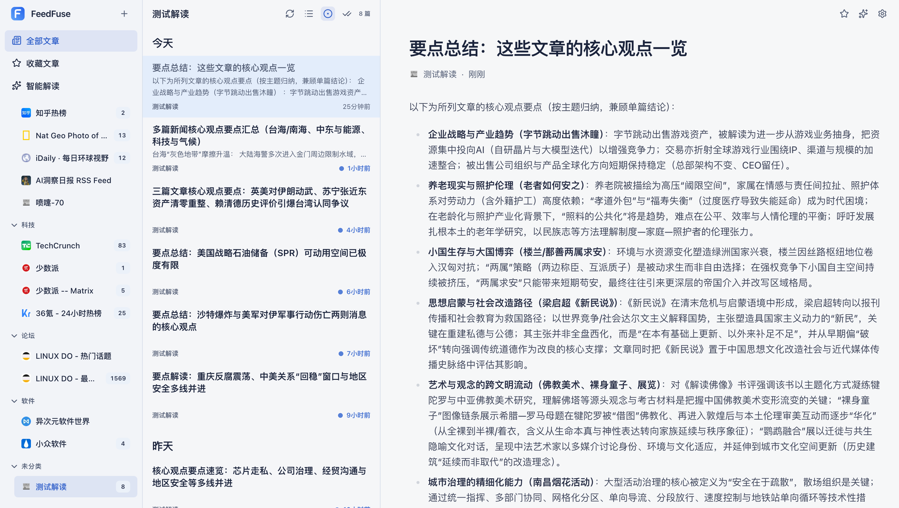

<p align="center">
  
</p>

<h1 align="center">FeedFuse</h1>

<p align="center">
  一个把 RSS 阅读、全文抓取和 AI 辅助理解放进同一工作台的信息阅读器。
</p>

<p align="center">
  它不替你决定看什么，只帮你更快找到重点、减少噪音，并把分散的信息整理成更清晰的判断。
</p>

## 为什么用 FeedFuse

FeedFuse 保留了 RSS 最有价值的部分：开放、可迁移、可掌控。同时，它把现代阅读里真正高频的能力整合进来，包括全文阅读、AI 摘要、标题翻译、正文翻译、双语阅读和文章过滤。

它更像一个个人信息工作台，而不是推荐算法驱动的信息流。订阅源由你决定，阅读节奏由你决定，AI 也只在你需要的时候参与。

从 RSS 收集，到关键词 / AI 过滤，再到 `AI解读` 汇聚重点，FeedFuse 把原本分散的阅读动作整理成一条连续的工作流，让你更稳定地从信息输入走到判断输出。

## 适合谁

- 想长期跟踪行业、产品、研究或新闻信息的人
- 想把多个 RSS 源集中管理，而不是来回切换工具的人
- 想用 AI 提高理解效率，但不想把信息选择权交给算法的人
- 想自托管阅读工具，保留数据与迁移自由的人

## 核心体验

- 在一个地方管理多个 RSS 源，并按分类整理
- 用“RSS 收集 → 关键词 / AI 过滤 → `AI解读` 汇聚”的工作流，把信息整理成更可用的结论
- 用三栏界面同时处理订阅、文章列表和正文阅读
- 为文章抓取全文，减少“只看到摘要、看不到内容”的情况
- 用 AI 摘要、标题翻译、正文翻译和双语阅读更快理解内容
- 用关键词过滤和 AI 过滤减少明显不想看的文章
- 把多个信息源汇总成一个 `AI解读` 源，从更高层看趋势和重点
- 通过 OPML 导入和导出订阅，方便备份和迁移

## 预览


<p align="center">首页/三栏阅读视图</p>



<p align="center">AI解读阅读视图</p>

## 快速开始

推荐直接使用 `docker compose`，默认配置即可跑起来。

### 1. 准备环境变量

```bash
cp .env.example .env
```

默认情况下，`.env.example` 已包含本地运行所需的基础配置：

- `DATABASE_URL`
- `IMAGE_PROXY_SECRET`

### 2. 启动服务

```bash
docker compose up --build
```

启动后访问：

```text
http://127.0.0.1:9559
```

`docker compose` 会同时启动：

- `db`：PostgreSQL
- `web`：FeedFuse Web 应用
- `worker`：后台任务进程，用于抓取全文、生成摘要、翻译和 `AI解读`

### 3. 首次使用

1. 添加自己的 RSS 源
2. 按需整理分类
3. 在设置中心补充 AI 配置
4. 开始阅读，并按需要生成摘要、翻译或 `AI解读`

## AI 配置

如果你只想先体验 RSS 阅读，AI 配置可以稍后再补。

启用 AI 后，FeedFuse 可以提供：

- `AI 摘要`
- 标题翻译
- 正文翻译
- 沉浸式双语阅读
- `AI解读`

你需要在设置中心填写：

- `AI 模型`
- `API 地址`
- `API 密钥`

翻译能力既可以复用主 AI 配置，也可以单独设置独立的翻译模型与密钥。

## 日常使用方式

FeedFuse 适合持续使用，而不是只在导入订阅的那一刻有价值。一个常见流程是：

1. 先用 RSS 建立稳定的信息来源
2. 用分类和过滤规则控制噪音
3. 对值得深读的文章抓取全文
4. 在需要时生成摘要或翻译
5. 用 `AI解读` 汇总多个来源，快速回看重点

## 本地开发

如果你想在本地参与开发，建议使用：

- `Node >=20.19.0`
- `pnpm@10`
- PostgreSQL 16

先准备数据库并写入 `.env`，然后执行：

```bash
pnpm install
node scripts/db/migrate.mjs
pnpm dev
```

另开一个终端启动 worker：

```bash
pnpm worker:dev
```

如果你只是想试用产品，优先使用上面的 `docker compose` 方式，会更直接。
